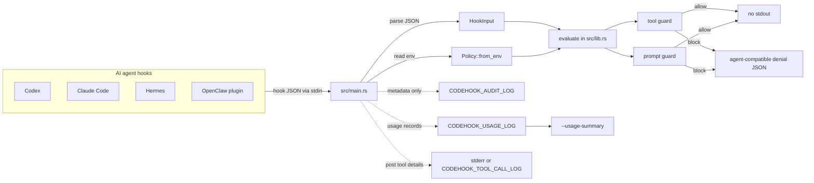

# codehook

`codehook` 是一个本地 Hook 策略守卫，用于在 AI 编程代理执行工具调用、
权限请求或向模型提交用户提示前做统一检查。它当前支持 Codex、Claude Code、
Hermes，以及通过 `examples/openclaw-plugin/` 接入的 OpenClaw。

核心行为很简单：

- 从 stdin 读取 Hook 事件 JSON。
- 根据 `CODEHOOK_AGENT`、环境变量、事件名和工具名识别调用来源。
- 加载本地策略并检查工具调用、路径访问和用户提示。
- 允许时不向 stdout 输出任何内容。
- 需要阻断时输出对应代理能识别的 JSON 决策。

示例中的二进制路径统一写成
`/path/to/codehook/target/release/codehook`。实际使用时请替换为本机
`cargo build --release` 后生成的绝对路径。

## 功能概览

- 支持 Codex、Claude Code、Hermes、OpenClaw 四类 Hook 输入。
- 拦截高风险 Shell 命令，例如 `git reset --hard`、强制推送、危险递归删除、
  直接写磁盘设备和 `curl | sh` 类安装命令。
- 拦截敏感路径访问，例如 `.env*`、`.git/`、`.ssh/`、`.gnupg/`、私钥文件和
  常见凭据文件。
- 拦截疑似包含私钥的用户提示，避免把敏感材料发送给模型。
- 可追加元数据审计日志，不记录完整命令、提示正文或工具输出。
- 可归一化记录 token 用量，并按 agent、model、session 汇总。
- 可记录 post-tool 工具详情，便于调试 Hermes 等代理的工具执行结果。
- 对不支持或不关心的事件默认放行，因此可以较宽地挂载到 Hook 流程中。

## 架构



运行主流程：

```text
stdin JSON -> HookInput -> Policy::from_env -> evaluate -> optional stdout JSON
```

用量统计侧路：

```text
stdin JSON or transcript JSONL -> usage extractor -> CODEHOOK_USAGE_LOG -> --usage-summary
```

工具详情侧路：

```text
post-tool event JSON -> detail formatter -> stderr and/or CODEHOOK_TOOL_CALL_LOG
```

## 项目结构

```text
codehook/
├── Cargo.toml
├── Cargo.lock
├── src/
│   ├── main.rs
│   └── lib.rs
├── examples/
│   ├── codex-hooks.json
│   ├── claude-settings.json
│   ├── hermes-config.yaml
│   └── openclaw-plugin/
│       ├── README.md
│       ├── index.ts
│       ├── openclaw.plugin.json
│       └── package.json
└── README.md
```

`src/main.rs` 是命令行入口，负责：

- 处理 `--help` 和 `--usage-summary`。
- 从 stdin 读取 Hook 事件 JSON。
- 从环境变量加载运行配置。
- 追加审计日志、token 用量日志和工具详情日志。
- 在需要阻断时向 stdout 输出 JSON 决策。

`src/lib.rs` 是可复用策略逻辑，负责：

- 定义 `HookInput`、`Policy`、`HookOutcome` 和 token 用量结构。
- 识别 Codex、Claude Code、Hermes、OpenClaw 或未知来源。
- 评估工具调用、权限请求和用户提示。
- 生成不同代理兼容的阻断 JSON。
- 提取、归一化和汇总 token 用量。
- 生成 post-tool 工具详情记录。
- 提供策略规则的单元测试。

`examples/` 提供可直接改造的集成样例：

- `examples/codex-hooks.json`：Codex Hook 配置。
- `examples/claude-settings.json`：Claude Code Hook 配置。
- `examples/hermes-config.yaml`：Hermes Hook 配置。
- `examples/openclaw-plugin/`：OpenClaw typed plugin 适配器。

## 构建与测试

构建 release 二进制：

```sh
cargo build --release
```

运行测试：

```sh
cargo test
```

查看命令帮助：

```sh
./target/release/codehook --help
```

## 本地验证

阻断危险命令：

```sh
printf '%s\n' '{
  "hook_event_name": "PreToolUse",
  "tool_name": "Bash",
  "tool_input": {"command": "git reset --hard HEAD"}
}' | CODEHOOK_AGENT=codex ./target/release/codehook
```

预期输出为 Codex 兼容的 deny JSON。安全事件不会输出 stdout：

```sh
printf '%s\n' '{
  "hook_event_name": "PreToolUse",
  "tool_name": "Read",
  "tool_input": {"file_path": "src/main.rs"}
}' | CODEHOOK_AGENT=claude ./target/release/codehook
```

## 默认策略

默认启用阻断策略。可通过 `CODEHOOK_ENFORCE=0` 只保留日志侧路而不阻断。

高风险命令规则包括：

- `git reset --hard`
- `git clean -fd` 或 `git clean -df`
- `git push --force` 或 `git push -f`
- `curl` 或 `wget` 下载内容后直接管道到 `sh`、`bash` 或 `zsh`
- `dd` 写入 `/dev/*`
- `mkfs`、`fdisk`、`diskutil erase`、`format`
- 对高风险目标执行递归强制删除，例如 `/`、`~`、`*`、`/etc`、`/usr`、
  `/bin`、`/sbin`、`/System`、`/Library`

敏感路径规则包括：

- 任意路径组件为 `.git`、`.ssh`、`.gnupg`
- `.env` 和 `.env.*`
- `id_rsa`、`id_dsa`、`id_ecdsa`、`id_ed25519`
- `credentials`、`credentials.json`、`service-account.json`
- 以 `.pem`、`.key`、`.p12`、`.pfx` 结尾的文件
- `CODEHOOK_PROTECTED_PATTERNS` 中配置的额外路径片段

提示词规则包括：

- 默认阻断包含 `-----BEGIN ... PRIVATE KEY-----` 形态的用户提示。
- 可通过 `CODEHOOK_BLOCK_SECRET_PROMPTS=0` 关闭该检查。

## 支持的事件

| 来源 | 事件 | 用途 |
| --- | --- | --- |
| Codex / Claude Code | `PreToolUse` | 工具执行前检查命令和路径 |
| Codex / Claude Code | `PermissionRequest` | 权限提升请求前再次检查命令和路径 |
| Codex / Claude Code | `UserPromptSubmit` | 用户提示进入模型前检查私钥内容 |
| Codex / Claude Code | `Stop` | 记录 token 用量 |
| Hermes | `pre_tool_call` | 工具执行前检查命令和路径 |
| Hermes | `pre_llm_call` | LLM 调用前检查用户提示 |
| Hermes | `post_tool_call` | 可选记录工具输入、响应和输出 |
| OpenClaw | `before_tool_call` | 工具执行前检查命令和路径 |
| OpenClaw | `before_agent_run` | agent 运行前检查用户提示 |
| OpenClaw | `llm_output` | 记录 token 用量元数据 |
| OpenClaw | `model_call_ended` | 记录 token 用量元数据 |

## Codex 接入

可以复制 `examples/codex-hooks.json` 到 `<repo>/.codex/hooks.json`，并把命令里的
二进制路径替换为本机路径。

核心配置形态如下：

```json
{
  "hooks": {
    "PreToolUse": [
      {
        "matcher": "Bash|apply_patch|Edit|Write",
        "hooks": [
          {
            "type": "command",
            "command": "CODEHOOK_AGENT=codex /path/to/codehook/target/release/codehook",
            "timeout": 10,
            "statusMessage": "Checking repository hook policy"
          }
        ]
      }
    ],
    "PermissionRequest": [
      {
        "matcher": "Bash|apply_patch|Edit|Write",
        "hooks": [
          {
            "type": "command",
            "command": "CODEHOOK_AGENT=codex /path/to/codehook/target/release/codehook",
            "timeout": 10,
            "statusMessage": "Checking approval request"
          }
        ]
      }
    ],
    "UserPromptSubmit": [
      {
        "hooks": [
          {
            "type": "command",
            "command": "CODEHOOK_AGENT=codex /path/to/codehook/target/release/codehook",
            "timeout": 10
          }
        ]
      }
    ],
    "Stop": [
      {
        "hooks": [
          {
            "type": "command",
            "command": "CODEHOOK_AGENT=codex CODEHOOK_USAGE_LOG=/path/to/codehook-usage.jsonl /path/to/codehook/target/release/codehook",
            "timeout": 10
          }
        ]
      }
    ]
  }
}
```

Codex 对新增或修改的非托管 Hook 会要求审核。配置完成后在 Codex 内执行
`/hooks`，确认并信任该 Hook。

## Claude Code 接入

可以复制 `examples/claude-settings.json` 到 `<repo>/.claude/settings.json`，并把
二进制路径替换为本机路径。

核心配置形态如下：

```json
{
  "hooks": {
    "PreToolUse": [
      {
        "matcher": "Bash|Read|Edit|Write|MultiEdit",
        "hooks": [
          {
            "type": "command",
            "command": "CODEHOOK_AGENT=claude /path/to/codehook/target/release/codehook",
            "timeout": 10
          }
        ]
      }
    ],
    "PermissionRequest": [
      {
        "matcher": "Bash|Read|Edit|Write|MultiEdit",
        "hooks": [
          {
            "type": "command",
            "command": "CODEHOOK_AGENT=claude /path/to/codehook/target/release/codehook",
            "timeout": 10
          }
        ]
      }
    ],
    "UserPromptSubmit": [
      {
        "hooks": [
          {
            "type": "command",
            "command": "CODEHOOK_AGENT=claude /path/to/codehook/target/release/codehook",
            "timeout": 10
          }
        ]
      }
    ],
    "Stop": [
      {
        "hooks": [
          {
            "type": "command",
            "command": "CODEHOOK_AGENT=claude CODEHOOK_USAGE_LOG=/path/to/codehook-usage.jsonl /path/to/codehook/target/release/codehook",
            "timeout": 10
          }
        ]
      }
    ]
  }
}
```

配置完成后在 Claude Code 内执行 `/hooks`，确认 Hook 已注册。

## Hermes 接入

可以把 `examples/hermes-config.yaml` 合并到 `~/.hermes/config.yaml`：

```yaml
hooks:
  pre_tool_call:
    - matcher: "terminal|write_file|patch"
      command: "/usr/bin/env CODEHOOK_AGENT=hermes CODEHOOK_USAGE_LOG=/path/to/codehook-usage.jsonl /path/to/codehook/target/release/codehook"
      timeout: 10
  pre_llm_call:
    - command: "/usr/bin/env CODEHOOK_AGENT=hermes CODEHOOK_USAGE_LOG=/path/to/codehook-usage.jsonl /path/to/codehook/target/release/codehook"
      timeout: 10
  post_tool_call:
    - matcher: "terminal|write_file|patch"
      command: "/usr/bin/env CODEHOOK_AGENT=hermes CODEHOOK_PRINT_TOOL_DETAILS=1 CODEHOOK_TOOL_CALL_LOG=/path/to/codehook-tool-calls.jsonl /path/to/codehook/target/release/codehook"
      timeout: 10
```

Hermes 以 `shell=false` 运行配置命令，因此示例使用 `/usr/bin/env` 设置环境变量，
而不是 shell 风格的行内赋值。

## OpenClaw 接入

OpenClaw 推荐通过 typed plugin 接入。`examples/openclaw-plugin/` 中的适配器会注册：

- `before_tool_call`：调用 `codehook` 检查工具策略。
- `before_agent_run`：调用 `codehook` 检查用户提示。
- `llm_output`：把用量元数据转发给 `codehook`。
- `model_call_ended`：把模型调用结束时的用量元数据转发给 `codehook`。

启动 OpenClaw Gateway 前设置：

```sh
export CODEHOOK_BIN=/path/to/codehook/target/release/codehook
export CODEHOOK_USAGE_LOG=/path/to/codehook-usage.jsonl
```

然后把 `examples/openclaw-plugin/` 安装或复制为本地 OpenClaw 插件，启用后重启
Gateway。

## Token 用量统计

设置 `CODEHOOK_USAGE_LOG` 后，`codehook` 会在事件中存在用量数据时追加 JSON Lines：

```sh
export CODEHOOK_USAGE_LOG=/path/to/codehook-usage.jsonl
```

每条记录包含元数据和归一化 token 字段：

- `input_tokens`
- `output_tokens`
- `cache_creation_input_tokens`
- `cache_read_input_tokens`
- `cached_input_tokens`
- `reasoning_output_tokens`
- `total_tokens`

提取器会识别常见 OpenAI、Anthropic 和代理别名，例如：

- `prompt_tokens`
- `completion_tokens`
- `inputTokens`
- `outputTokens`
- `cacheReadInputTokens`
- `cacheCreationInputTokens`
- `reasoningOutputTokens`

Claude Code 的 Hook payload 可能不直接包含 usage。当 `transcript_path` 存在时，
`codehook` 会尝试读取 transcript JSONL，并使用最后一条包含 usage 的记录。关闭该
回退逻辑：

```sh
export CODEHOOK_USAGE_FROM_TRANSCRIPT=0
```

汇总用量日志：

```sh
/path/to/codehook/target/release/codehook --usage-summary /path/to/codehook-usage.jsonl
```

汇总结果按 agent、model 和 session 分组。

## 审计与工具详情日志

元数据审计日志：

```sh
export CODEHOOK_AUDIT_LOG=/path/to/codehook-audit.jsonl
```

审计记录包含时间戳、agent、event、session、cwd、tool_name、是否阻断和阻断原因，
不包含完整提示、命令或工具输出。

post-tool 工具详情：

```sh
export CODEHOOK_PRINT_TOOL_DETAILS=1
export CODEHOOK_TOOL_CALL_LOG=/path/to/codehook-tool-calls.jsonl
```

工具详情记录包含 metadata、`tool_input`、`tool_response`、`tool_output` 和额外
payload 字段。它可能包含完整工具输出，应写入访问受控的位置。

## 运行配置

所有运行配置都通过环境变量设置：

| 变量 | 说明 |
| --- | --- |
| <code>CODEHOOK_AGENT=codex&#124;claude&#124;hermes&#124;openclaw</code> | 显式指定调用来源 |
| `CODEHOOK_ENFORCE=0` | 关闭阻断决策，仅保留日志等副作用 |
| `CODEHOOK_BLOCK_SECRET_PROMPTS=0` | 关闭用户提示私钥检查 |
| `CODEHOOK_PROTECTED_PATTERNS=secret/,prod.env` | 添加逗号分隔的敏感路径片段 |
| `CODEHOOK_AUDIT_LOG=/path/log.jsonl` | 追加元数据审计日志 |
| `CODEHOOK_USAGE_LOG=/path/usage.jsonl` | 追加 token 用量记录 |
| `CODEHOOK_PRINT_TOOL_DETAILS=1` | 将 post-tool 详情打印到 stderr |
| `CODEHOOK_TOOL_CALL_LOG=/path/tool-calls.jsonl` | 追加 post-tool 详情 JSON Lines |
| `CODEHOOK_USAGE_FROM_TRANSCRIPT=0` | 关闭 transcript 用量提取回退 |

`CODEHOOK_AGENT` 推荐显式设置。未设置时，`codehook` 会按环境变量、事件名和工具名
推断来源。Claude Code 可使用 `cc`、`claudecode`、`claude-code`、`claude_code`
作为别名；OpenClaw 可使用 `open-claw`、`open_claw`、`oc` 作为别名。

布尔类开关中，`0`、`false`、`no`、`off` 都会被视为关闭。

## 开发维护

修改策略时优先更新 `src/lib.rs` 中的单元测试，覆盖阻断原因、输出 JSON 形状和
允许路径。常用验证命令：

```sh
cargo test
cargo build --release
```

文档中所有代理配置都应和 `examples/` 保持一致。新增支持的 Hook 来源时，应同步更新：

- `HookInput` 字段别名和 agent 检测逻辑。
- `evaluate` 中的事件分发。
- 对应代理的阻断输出格式。
- `examples/` 下的配置或插件适配器。
- README 的架构图、事件表和配置说明。
